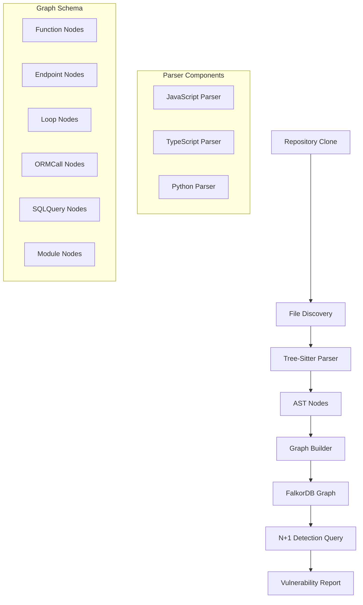
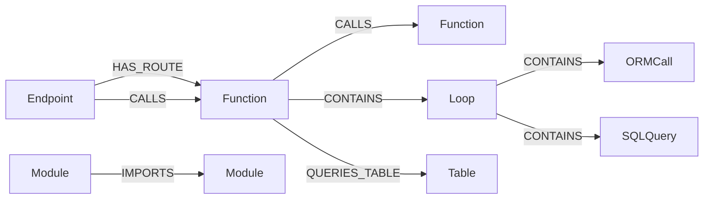
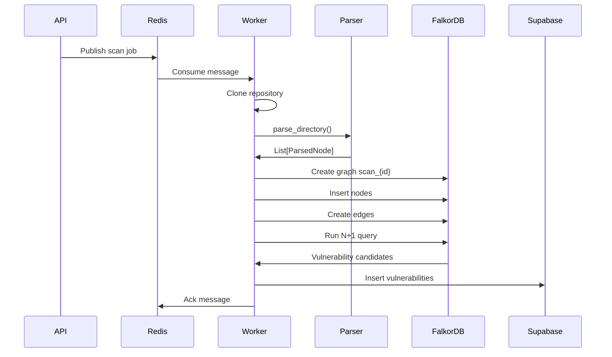

# Week 2 Implementation Plan: Tree-Sitter Parser + FalkorDB Graph Population

**Objective:** Parse Juice Shop code into a knowledge graph and detect N+1 query vulnerabilities.

**Exit Criteria:**
- `core/parser.py` complete and tested on 3 Juice Shop files
- FalkorDB populated with Function, Endpoint, Loop, ORMCall nodes
- N+1 Cypher query returns ≥1 result from Juice Shop
- `/scan/{id}/status` returns real data from Supabase

---

## Architecture Overview



---

## Part 1: Tree-Sitter Parser Implementation

### 1.1 Dependencies and Setup

**Required packages (exact versions as specified):**
```bash
pip install tree-sitter==0.24.0
pip install tree-sitter-javascript
pip install tree-sitter-typescript  
pip install tree-sitter-python
pip install falkordb
pip install supabase
pip install graphrag_sdk  # Week 3 prep
```

**Import pattern (v0.24.0 API - CRITICAL):**
```python
import tree_sitter_javascript as tsjs
import tree_sitter_typescript as tstypes
import tree_sitter_python as tspy
from tree_sitter import Language, Parser

# JavaScript
JS_LANGUAGE = Language(tsjs.language())
js_parser = Parser(JS_LANGUAGE)

# TypeScript
TS_LANGUAGE = Language(tstypes.language_typescript())
ts_parser = Parser(TS_LANGUAGE)

# Python
PY_LANGUAGE = Language(tspy.language())
py_parser = Parser(PY_LANGUAGE)
```

### 1.2 File Structure

```
vibecheck/core/
├── parser.py              # Main parser module (NEW)
│   ├── CodeParser         # Main parser class
│   ├── ParsedNode         # Data class for parsed nodes
│   ├── parse_file()       # Parse single file
│   └── parse_directory()  # Parse entire directory
```

### 1.3 Node Types to Extract

| Node Type | Tree-Sitter Query | Properties to Capture | FalkorDB Label |
|-----------|-------------------|----------------------|----------------|
| Function Declaration | `function_declaration` | name, file, line_start, line_end, async | `Function` |
| Arrow Function | `arrow_function` | name (if assigned), file, line_start, line_end | `Function` |
| Method Definition | `method_definition` | name, class, file, line_start, line_end | `Function` |
| Express Route | See query below | method, path, handler, file, line | `Endpoint` |
| For Statement | `for_statement` | file, line_start, line_end, is_dynamic | `Loop` |
| While Statement | `while_statement` | file, line_start, line_end | `Loop` |
| For-In Statement | `for_in_statement` | file, line_start, line_end | `Loop` |
| ORM Call | See query below | method, model, file, line | `ORMCall` |
| SQL Template | `tagged_template_expression` | query, file, line | `SQLQuery` |
| Import Statement | `import_statement` | source, specifiers, file | `Module` |
| Require Call | `call_expression` with require | module, file | `Module` |

### 1.4 Express Route Detection Query

```python
ROUTE_QUERY = """
(call_expression
  function: (member_expression
    object: (identifier) @obj
    property: (property_identifier) @method
    (#match? @method "^(get|post|put|delete|patch|use)$"))
  arguments: (arguments
    (string) @route_path
    .
    (_) @handler))
"""
```

This captures:
- `@obj`: The router object (app, router, etc.)
- `@method`: HTTP method (get, post, etc.)
- `@route_path`: The route path string
- `@handler`: The handler function

### 1.5 ORM Call Detection

ORM patterns to detect inside loops:
```javascript
// Sequelize patterns
Model.find({ where: {...} })
Model.findAll({ where: {...} })
Model.findOne({ where: {...} })
Model.findByPk(id)

// Mongoose patterns  
Model.find({ ... })
Model.findOne({ ... })
Model.findById(id)

// Query builder patterns
.query()
.where()
```

Tree-Sitter query for ORM calls:
```python
ORM_CALL_QUERY = """
(call_expression
  function: (member_expression
    property: (property_identifier) @method
    (#match? @method "^(find|findAll|findOne|findByPk|findById|save|create|update|destroy)$"))
  arguments: (arguments) @args)
"""
```

**IMPORTANT:** Regex ends with `$` not `$/` - no trailing slash.

### 1.6 Parser Class Design

```python
@dataclass
class ParsedNode:
    """Represents a parsed code entity."""
    node_type: str           # Function, Endpoint, Loop, ORMCall, SQLQuery, Module
    name: str | None
    file_path: str
    line_start: int
    line_end: int
    properties: dict[str, Any]
    source_code: str | None = None


class CodeParser:
    """Tree-Sitter based code parser."""
    
    def __init__(self):
        self.js_parser = Parser(Language(tsjs.language()))
        self.ts_parser = Parser(Language(tstypes.language_typescript()))
        self.py_parser = Parser(Language(tspy.language()))
    
    def parse_file(self, file_path: Path) -> list[ParsedNode]:
        """Parse a single file and extract all nodes."""
        
    def parse_directory(
        self, 
        dir_path: Path, 
        extensions: list[str] = ['.js', '.ts', '.py']
    ) -> list[ParsedNode]:
        """Parse all files in a directory."""
        
    def _extract_functions(self, tree, source: bytes, file_path: str) -> list[ParsedNode]:
        """Extract function declarations, arrow functions, methods."""
        
    def _extract_endpoints(self, tree, source: bytes, file_path: str) -> list[ParsedNode]:
        """Extract Express route definitions."""
        
    def _extract_loops(self, tree, source: bytes, file_path: str) -> list[ParsedNode]:
        """Extract for/while loops."""
        
    def _extract_orm_calls(self, tree, source: bytes, file_path: str) -> list[ParsedNode]:
        """Extract ORM method calls."""
        
    def _extract_sql_queries(self, tree, source: bytes, file_path: str) -> list[ParsedNode]:
        """Extract SQL template literals."""
        
    def _extract_imports(self, tree, source: bytes, file_path: str) -> list[ParsedNode]:
        """Extract import/require statements."""
```

---

## Part 2: FalkorDB Graph Population

### 2.1 FalkorDB Client Update

Replace the current redis-py raw command implementation with the official `falkordb` package:

```python
from falkordb import FalkorDB

class FalkorDBClient:
    def __init__(self, host: str = 'localhost', port: int = 6379):
        self._client = FalkorDB(host=host, port=port)
        
    def create_scan_graph(self, scan_id: str):
        """Create/select graph for a scan and create indexes."""
        graph = self._client.select_graph(f'scan_{scan_id}')
        
        # CRITICAL: Create indexes BEFORE any data insert
        index_queries = [
            "CREATE INDEX FOR (f:Function) ON (f.file)",
            "CREATE INDEX FOR (l:Loop) ON (l.file)",
            "CREATE INDEX FOR (o:ORMCall) ON (o.file)",
            "CREATE INDEX FOR (e:Endpoint) ON (e.path)",
        ]
        for query in index_queries:
            graph.query(query)
        
        return graph
    
    def add_nodes_batch(self, graph, nodes: list[ParsedNode]):
        """Batch insert nodes grouped by type.
        
        CRITICAL: Labels cannot be dynamic in Cypher.
        Group nodes by type and run one UNWIND per label.
        Never use CREATE (n:node.type) - this is invalid!
        """
        from collections import defaultdict
        
        # Group nodes by their type
        nodes_by_type = defaultdict(list)
        for node in nodes:
            nodes_by_type[node.node_type].append(node)
        
        # Run one UNWIND query per label
        for node_type, typed_nodes in nodes_by_type.items():
            query = f"""
            UNWIND $nodes AS node
            CREATE (n:{node_type})
            SET n += node.properties
            """
            graph.query(query, {'nodes': [n.to_dict() for n in typed_nodes]})
```

### 2.2 Graph Schema



### 2.3 Node Properties

**Function Node:**
```json
{
  "name": "getUserById",
  "file": "/routes/users.js",
  "line_start": 15,
  "line_end": 25,
  "is_async": true,
  "params": ["id", "callback"]
}
```

**Endpoint Node:**
```json
{
  "method": "GET",
  "path": "/api/users/:id",
  "file": "/routes/users.js",
  "line": 45,
  "handler": "getUserById"
}
```

**Loop Node:**
```json
{
  "type": "for_statement",
  "file": "/routes/users.js",
  "line_start": 50,
  "line_end": 60,
  "is_dynamic": true,
  "iterator_var": "userId"
}
```

**ORMCall Node:**
```json
{
  "method": "findAll",
  "model": "User",
  "file": "/routes/users.js",
  "line": 52,
  "has_where": true
}
```

### 2.4 Edge Creation

**CRITICAL:** Do ALL containment detection inside single Cypher queries, not Python nested loops.
Use `WHERE f.file = l.file AND line range overlap` in Cypher.

```python
def create_edges(self, graph):
    """Create all edges using Cypher queries for containment detection."""
    
    # CONTAINS edges: Function -> Loop (using Cypher for containment)
    graph.query("""
        MATCH (f:Function), (l:Loop)
        WHERE f.file = l.file 
          AND l.line_start >= f.line_start 
          AND l.line_end <= f.line_end
        CREATE (f)-[:CONTAINS]->(l)
    """)
    
    # CONTAINS edges: Loop -> ORMCall (using Cypher for containment)
    graph.query("""
        MATCH (l:Loop), (o:ORMCall)
        WHERE l.file = o.file 
          AND o.line >= l.line_start 
          AND o.line <= l.line_end
        CREATE (l)-[:CONTAINS]->(o)
    """)
    
    # CONTAINS edges: Loop -> SQLQuery (using Cypher for containment)
    graph.query("""
        MATCH (l:Loop), (s:SQLQuery)
        WHERE l.file = s.file 
          AND s.line >= l.line_start 
          AND s.line <= l.line_end
        CREATE (l)-[:CONTAINS]->(s)
    """)
    
    # HAS_ROUTE edges: Endpoint -> Function (match handler name)
    graph.query("""
        MATCH (e:Endpoint), (f:Function)
        WHERE e.handler = f.name AND e.file = f.file
        CREATE (e)-[:HAS_ROUTE]->(f)
    """)
    
    # CALLS edges: Function -> Function (requires call graph analysis)
    # TODO: Week 3 - Implement call graph analysis
    
    # IMPORTS edges: Module -> Module
    graph.query("""
        MATCH (m1:Module), (m2:Module)
        WHERE m1.source = m2.name
        CREATE (m1)-[:IMPORTS]->(m2)
    """)
```

---

## Part 3: N+1 Detection Query

### 3.1 Cypher Query

```cypher
MATCH (e:Endpoint)-[:CALLS*1..5]->(l:Loop)-[:CONTAINS]->(q:ORMCall)
WHERE l.is_dynamic = true
RETURN e.path, e.method, l.file, l.line_start, q.method, q.model
```

This query finds:
1. Endpoints that call functions
2. Those functions contain loops
3. The loops contain ORM calls
4. The loops are dynamic (iterate over user input)

### 3.2 Detection Logic

An N+1 query vulnerability occurs when:
1. An endpoint receives a list of IDs
2. Code iterates over the list
3. Each iteration makes a database query

Example vulnerable pattern:
```javascript
app.get('/api/users', async (req, res) => {
  const userIds = req.query.ids.split(',');
  const users = [];
  for (const id of userIds) {  // Loop is dynamic
    const user = await User.findByPk(id);  // ORM call inside loop
    users.push(user);
  }
  res.json(users);
});
```

---

## Part 4: Supabase Status Endpoints

### 4.1 Supabase Client

**CRITICAL:** The supabase Python SDK has NO async support. All methods must be sync internally, wrapped in `asyncio.get_event_loop().run_in_executor(None, sync_fn)`.

```python
import asyncio
from supabase import create_client, Client

class SupabaseClient:
    def __init__(self, url: str, key: str):
        self._client: Client = create_client(url, key)
    
    def _get_scan_status_sync(self, scan_id: str) -> dict:
        """Sync method - call via run_in_executor."""
        result = self._client.table('scan_queue').select('*').eq('id', scan_id).single()
        return result.data
    
    async def get_scan_status(self, scan_id: str) -> dict:
        """Async wrapper using run_in_executor."""
        loop = asyncio.get_event_loop()
        return await loop.run_in_executor(
            None, 
            lambda: self._get_scan_status_sync(scan_id)
        )
    
    def _get_vulnerabilities_sync(self, scan_id: str) -> list[dict]:
        """Sync method - call via run_in_executor."""
        result = self._client.table('vulnerabilities').select('*').eq('scan_id', scan_id)
        return result.data
    
    async def get_vulnerabilities(self, scan_id: str) -> list[dict]:
        """Async wrapper using run_in_executor."""
        loop = asyncio.get_event_loop()
        return await loop.run_in_executor(
            None,
            lambda: self._get_vulnerabilities_sync(scan_id)
        )
    
    def _insert_vulnerability_sync(self, scan_id: str, vuln: dict) -> dict:
        """Sync method - call via run_in_executor."""
        result = self._client.table('vulnerabilities').insert({
            'scan_id': scan_id,
            **vuln
        }).execute()
        return result.data
    
    async def insert_vulnerability(self, scan_id: str, vuln: dict) -> dict:
        """Async wrapper using run_in_executor."""
        loop = asyncio.get_event_loop()
        return await loop.run_in_executor(
            None,
            lambda: self._insert_vulnerability_sync(scan_id, vuln)
        )
```

### 4.2 API Route Updates

Update [`api/routes/scan.py`](vibecheck/api/routes/scan.py):

```python
@router.get("/{scan_id}/status")
async def get_scan_status(scan_id: str) -> ScanStatusResponse:
    supabase = get_supabase_client()
    scan = await supabase.get_scan_status(scan_id)
    
    return ScanStatusResponse(
        scan_id=scan_id,
        status=scan['status'],
        progress=scan['progress'],
        error_message=scan.get('error_message'),
        started_at=scan.get('started_at'),
        completed_at=scan.get('completed_at'),
        created_at=scan['created_at'],
    )
```

Update [`api/routes/report.py`](vibecheck/api/routes/report.py):

```python
@router.get("/{scan_id}/vulnerabilities")
async def get_vulnerabilities(scan_id: str) -> list[VulnerabilityResponse]:
    supabase = get_supabase_client()
    vulns = await supabase.get_vulnerabilities(scan_id)
    return [VulnerabilityResponse(**v) for v in vulns]
```

---

## Part 5: Worker Integration

### 5.1 Updated Scan Flow



### 5.2 Worker Code Changes

Update [`worker/scan_worker.py`](vibecheck/worker/scan_worker.py):

```python
async def process_message(self, message: dict[str, Any]) -> None:
    # ... existing clone logic ...
    
    # NEW: Parse with Tree-Sitter
    parser = CodeParser()
    nodes = await loop.run_in_executor(
        None, 
        lambda: parser.parse_directory(clone_dir)
    )
    logger.info(f"Parsed {len(nodes)} nodes from {clone_dir}")
    
    # NEW: Populate FalkorDB graph
    falkordb = get_falkordb_client()
    graph = falkordb.create_scan_graph(scan_id)
    
    # Batch insert nodes
    await loop.run_in_executor(
        None,
        lambda: falkordb.add_nodes_batch(graph, nodes)
    )
    
    # Create edges
    await loop.run_in_executor(
        None,
        lambda: falkordb.create_edges(graph, nodes)
    )
    
    # NEW: Run N+1 detection
    n_plus_ones = await loop.run_in_executor(
        None,
        lambda: falkordb.detect_n_plus_1(graph)
    )
    logger.info(f"Found {len(n_plus_ones)} N+1 candidates")
    
    # NEW: Save to Supabase
    supabase = get_supabase_client()
    for vuln in n_plus_ones:
        await supabase.insert_vulnerability(scan_id, vuln)
```

---

## Part 6: Testing Strategy

### 6.1 Test Files from Juice Shop

Select 3 representative files:
1. **`routes/user.ts`** - Contains endpoints and database queries
2. **`routes/products.ts`** - Contains loops and ORM operations
3. **`models/user.ts`** - Contains model definitions

### 6.2 Test Cases

```python
def test_parse_javascript_function():
    parser = CodeParser()
    nodes = parser.parse_file('test/fixtures/sample.js')
    functions = [n for n in nodes if n.node_type == 'Function']
    assert len(functions) > 0
    assert any(f.name == 'getUser' for f in functions)

def test_extract_express_routes():
    parser = CodeParser()
    nodes = parser.parse_file('test/fixtures/routes.js')
    endpoints = [n for n in nodes if n.node_type == 'Endpoint']
    assert any(e.properties['method'] == 'GET' for e in endpoints)

def test_detect_orm_in_loop():
    parser = CodeParser()
    nodes = parser.parse_file('test/fixtures/n_plus_one.js')
    loops = [n for n in nodes if n.node_type == 'Loop']
    orm_calls = [n for n in nodes if n.node_type == 'ORMCall']
    
    # Verify ORM call is inside loop
    for orm in orm_calls:
        for loop in loops:
            if loop.contains(orm):
                assert loop.is_dynamic

def test_n_plus_one_detection():
    # Full integration test
    # Parse, populate graph, run query
    # Verify ≥1 result
```

---

## Implementation Order

1. **Day 1-2:** Tree-Sitter parser setup and function extraction
2. **Day 3:** Express route and loop detection
3. **Day 4:** ORM call and SQL query detection
4. **Day 5:** FalkorDB client update and graph population
5. **Day 6:** N+1 detection query and worker integration
6. **Day 7:** Supabase endpoints and testing

---

## Risk Mitigation

| Risk | Mitigation |
|------|------------|
| Tree-Sitter API changes | Use exact v0.24.0 as specified |
| Large file parsing | Implement file size limit (1MB) |
| Memory usage | Process files in batches of 100 |
| FalkorDB connection issues | Add retry logic with exponential backoff |
| False positives in N+1 | Mark as candidates, verify in Week 3 with LLM |

---

## Files to Create/Modify

### New Files
- `vibecheck/core/parser.py` - Tree-Sitter parser
- `vibecheck/core/supabase_client.py` - Supabase client wrapper
- `vibecheck/tests/test_parser.py` - Parser unit tests
- `vibecheck/tests/test_week2.py` - Integration tests

### Modified Files
- `vibecheck/core/falkordb.py` - Update to use official falkordb package
- `vibecheck/worker/scan_worker.py` - Add parser integration
- `vibecheck/api/routes/scan.py` - Add real Supabase queries
- `vibecheck/api/routes/report.py` - Add real Supabase queries
- `vibecheck/requirements.txt` - Add new dependencies
- `vibecheck/core/config.py` - Add Supabase config if needed
