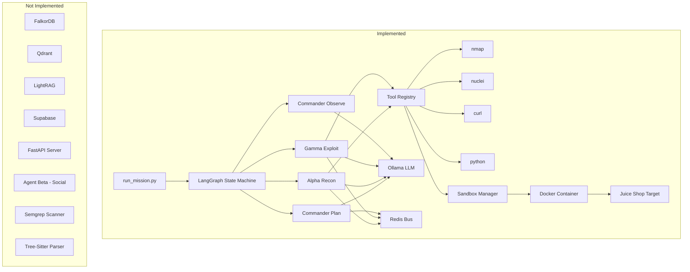

# Codebase Analysis: Project VibeCheck Red Team

## Executive Summary

The codebase implements **Phase 3 (Red Team Swarm)** of the PRD, focusing on autonomous red team operations against OWASP Juice Shop. The **Blue Team pipeline** (Stages 1-9 for code scanning/vulnerability detection) has **not been implemented**.

---

## Implementation Status by PRD Section

### ✅ Fully Implemented

#### 1. Red Team Agent Swarm (PRD Section 6)

| Component | PRD Requirement | Implementation Status | File |
|-----------|-----------------|----------------------|------|
| Commander Agent | Qwen3-235B via OpenRouter | ✅ Implemented (uses Ollama) | [`agents/commander.py`](agents/commander.py) |
| Agent Alpha (Recon) | mistral-nemo:12b | ✅ Implemented | [`agents/alpha_recon.py`](agents/alpha_recon.py) |
| Agent Gamma (Exploit) | qwen2.5-coder:7b | ✅ Implemented | [`agents/gamma_exploit.py`](agents/gamma_exploit.py) |
| LangGraph Orchestration | Hierarchical state machine | ✅ Implemented | [`agents/graph.py`](agents/graph.py) |
| A2A Message Schema | JSON schema per PRD | ✅ Implemented | [`agents/a2a/messages.py`](agents/a2a/messages.py) |
| Redis Blackboard | HSET/HGET shared state | ✅ Implemented | [`agents/a2a/blackboard.py`](agents/a2a/blackboard.py) |

#### 2. Tool System

| Tool | Description | File |
|------|-------------|------|
| nmap | Port scanning, service detection | [`agents/tools/nmap_tool.py`](agents/tools/nmap_tool.py) |
| nuclei | Vulnerability scanning with templates | [`agents/tools/nuclei_tool.py`](agents/tools/nuclei_tool.py) |
| curl | HTTP request crafting | [`agents/tools/curl_tool.py`](agents/tools/curl_tool.py) |
| python | Python script execution | [`agents/tools/python_exec.py`](agents/tools/python_exec.py) |
| Registry | Dynamic tool discovery | [`agents/tools/registry.py`](agents/tools/registry.py) |

#### 3. Core Infrastructure

| Component | Technology | File |
|-----------|------------|------|
| Redis Bus | Redis Streams for A2A messaging | [`core/redis_bus.py`](core/redis_bus.py) |
| Ollama Client | Local LLM inference | [`core/ollama_client.py`](core/ollama_client.py) |
| OpenRouter Client | Cloud LLM with fallback | [`core/openrouter_client.py`](core/openrouter_client.py) |
| Configuration | pydantic-settings | [`core/config.py`](core/config.py) |

#### 4. Sandbox System

| Component | Description | File |
|-----------|-------------|------|
| Sandbox Manager | Docker-in-Docker isolation | [`sandbox/sandbox_manager.py`](sandbox/sandbox_manager.py) |
| Dockerfile | Sandbox image with tools | [`sandbox/Dockerfile.sandbox`](sandbox/Dockerfile.sandbox) |

#### 5. Scripts & Utilities

| Script | Purpose | File |
|--------|---------|------|
| run_mission.py | CLI mission runner | [`scripts/run_mission.py`](scripts/run_mission.py) |
| health_check.py | Infrastructure verification | [`scripts/health_check.py`](scripts/health_check.py) |

#### 6. Tests

| Test File | Coverage |
|-----------|----------|
| [`tests/test_agents.py`](tests/test_agents.py) | Graph construction, routing logic |
| [`tests/test_messaging.py`](tests/test_messaging.py) | A2A serialization, payload schemas |

---

### ❌ Not Implemented

#### 1. Blue Team Pipeline (PRD Stages 1-9)

| Stage | Description | Status |
|-------|-------------|--------|
| Stage 1 | GitHub Webhook → FastAPI trigger | ❌ Missing |
| Stage 2 | Git clone + file walker | ❌ Missing |
| Stage 3 | Dependency Audit (npm/pip audit) | ❌ Missing |
| Stage 4 | Tree-Sitter Structural Extraction | ❌ Missing |
| Stage 4b | Semantic Lifting (Ollama summaries) | ❌ Missing |
| Stage 5 | FalkorDB Graph Construction | ❌ Missing |
| Stage 5b | Qdrant + LightRAG Population | ❌ Missing |
| Stage 6 | Six Parallel Detectors | ❌ Missing |
| Stage 7 | LLM Verification | ❌ Missing |
| Stage 7b | Architectural Analysis (Gemini) | ❌ Missing |
| Stage 8 | Write Results to Supabase | ❌ Missing |
| Stage 9 | Auto-Remediation & PR Generation | ❌ Missing |

#### 2. Missing Infrastructure Components

| Component | PRD Requirement | Status |
|-----------|-----------------|--------|
| FalkorDB | Structural Graph RAG | ❌ Not in docker-compose |
| Qdrant | Vector Store | ❌ Not in docker-compose |
| LightRAG | GraphRAG Engine | ❌ Not integrated |
| Supabase | Relational DB + Auth | ❌ Not integrated |
| FastAPI | API Server | ❌ Missing |

#### 3. Missing Agents

| Agent | PRD Role | Status |
|-------|----------|--------|
| Agent Beta | Social Engineering (Gemini 2.0 Flash) | ❌ Not implemented |

#### 4. Missing Detection Capabilities

| Detector | PRD Description | Status |
|----------|-----------------|--------|
| Detector A | N+1 Query Pattern (FalkorDB Cypher) | ❌ Missing |
| Detector B | Taint Flow/Injection (Semgrep) | ❌ Missing |
| Detector C | Hardcoded Secrets (Semgrep) | ❌ Missing |
| Detector D | Unguarded Routes (FalkorDB Cypher) | ❌ Missing |
| Detector E | O(n²) Complexity (Tree-Sitter) | ❌ Missing |
| Detector F | Vulnerable Dependencies (npm/pip audit) | ❌ Missing |

#### 5. Missing UI/Dashboard

| Component | PRD Requirement | Status |
|-----------|-----------------|--------|
| Next.js Dashboard | React Flow kill chain | ❌ Missing |
| Supabase Realtime | Live updates | ❌ Missing |

---

## Architecture Diagram: Current Implementation

---

## Key Observations

### What Works Well

1. **Clean Agent Architecture**: The LangGraph state machine provides clear separation of concerns
2. **Tool Abstraction**: Dynamic tool registry allows easy extension
3. **Sandbox Isolation**: Docker-based execution provides safe tool execution
4. **A2A Messaging**: Well-defined message schema with proper serialization
5. **Fallback Handling**: OpenRouter client has retry + model fallback logic

### Gaps vs PRD

1. **No Blue Team**: The entire vulnerability scanning pipeline is missing
2. **No Persistence**: Results are not stored in Supabase
3. **No API**: No FastAPI endpoints for triggering missions
4. **Limited LLM Usage**: Commander uses Ollama instead of OpenRouter Qwen3-235B
5. **No HITL**: Human-in-the-loop approval gates are defined but not implemented
6. **No Agent Beta**: Social engineering agent completely missing

---

## PRD Phase Alignment

| PRD Phase | Description | Status |
|-----------|-------------|--------|
| Phase 1 | Ingestion + Structural Layer | ❌ Not Started |
| Phase 2 | Detection + Semantic Layer | ❌ Not Started |
| Phase 3 | Red Team Swarm + Dashboard | ⚠️ Partial (Red Team only, no dashboard) |

---

## Recommended Next Steps

### Priority 1: Complete Red Team Integration
- [ ] Add Agent Beta (Social Engineering)
- [ ] Implement HITL approval gates
- [ ] Connect Commander to OpenRouter for Qwen3-235B

### Priority 2: Begin Blue Team Pipeline
- [ ] Add FalkorDB to docker-compose
- [ ] Add Qdrant to docker-compose
- [ ] Implement Tree-Sitter structural extraction
- [ ] Implement Semgrep integration

### Priority 3: Add Persistence Layer
- [ ] Integrate Supabase
- [ ] Create FastAPI endpoints
- [ ] Store mission results in database

### Priority 4: Build Dashboard
- [ ] Create Next.js application
- [ ] Implement React Flow kill chain visualization
- [ ] Add Supabase Realtime subscriptions
